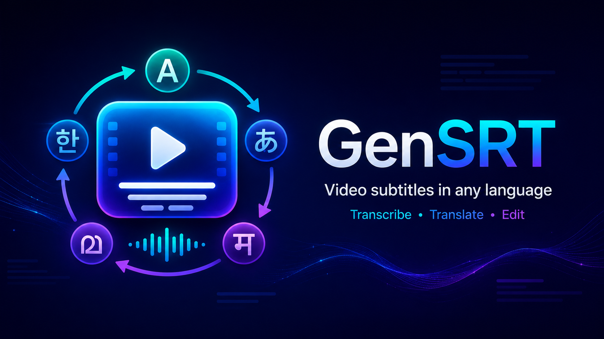
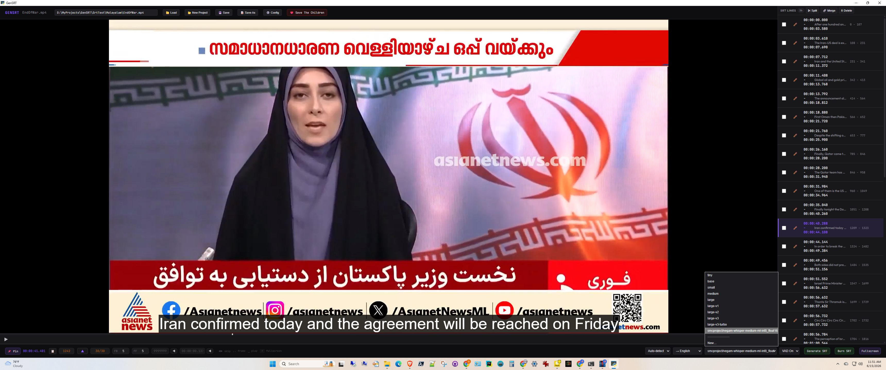

  

  
  
  
  

  <b>GPU-accelerated subtitle generation for Windows.</b> 
  Transcribe video to SRT using OpenAI Whisper, translate any-to-any via Google Translate, edit cues in a built-in player.

---

## What it does

GenSRT generates SRT subtitle files from video using GPU-accelerated speech recognition, with built-in editing and any-to-any translation. The target use cases are serious subtitle work — content creators, fan subtitlers, accessibility teams, researchers working with non-English media.

- **Transcribe.** Drop a video file, pick a language (or auto-detect), generate an SRT. Built-in support for OpenAI Whisper sizes (`tiny` through `large-v3-turbo`) plus any HuggingFace-compatible faster-whisper model — including community fine-tunes for specific languages.
- **Translate.** Translate the generated SRT to any of 100+ languages via Google Translate. Translation happens cue-by-cue, preserving original timestamps. MyMemory fallback for offline scenarios or rate-limit cases.
- **Edit.** Built-in player with live subtitle display. Split, merge, delete, and edit cues with immediate feedback in the player. Save to disk as SRT and WebVTT in one operation.

  

  
  <i>Screenshot: Malayalam audio from an Asianet News clip on the US–Iran truce, transcribed with <code>smcproject/vegam-whisper-medium-ml-int8_float16</code> using v1.2's chunked inference and translated to English. The "Circ Circ Circ…" row in the cue list is a known fine-tuned-Whisper hallucination GenSRT displays as-is — see <a href="#known-limitations">Known Limitations</a>.</i>
  

## What's new in v1.2

**Chunked inference for fine-tuned Whisper models.** Community fine-tunes like SMC's `vegam-whisper-medium-ml` (for Malayalam) were practically unusable on long-form audio — they would transcribe the first 6-8 seconds and silently drop the rest. v1.2 solves this with silent-boundary chunked inference: audio is sliced along naturally-detected pauses, each chunk is transcribed independently, and the results are assembled into a single SRT with original timestamps preserved.

For Malayalam users with vegam, this produces 2-3× more transcribed content than running the same model without chunking. The chunked path engages automatically — no configuration required.

See the [v1.2 release notes](https://github.com/mountlord/GenSRT/releases/tag/v1.2.0) for the full changelog.

## Quick start

1. Download `gensrt-install.exe` from the [latest release](https://github.com/mountlord/GenSRT/releases) and run it. It's a 7z self-extracting installer — pick a folder, and it'll unpack GenSRT there.
2. Run `gensrt.exe` from the install folder. The GUI opens.
3. Drop a video file onto the player. The Model selector in the footer defaults to `large-v3-turbo` (works well for English and most European languages).
4. Click **Generate SRT**. The model auto-downloads on first use (~1-2 GB depending on the model), then transcription begins.
5. When done, the right-pane cue list populates and subtitles display in the in-player overlay during playback.

> **First-run note:** the first time you generate an SRT with a given model, the model auto-downloads to your HuggingFace cache (~1-2 GB). The download is one-time. On CPU-only machines, transcription itself runs to completion but takes substantially longer than on a CUDA GPU — see [Requirements](#requirements) for typical timings.

**For Malayalam:** select `smcproject/vegam-whisper-medium-ml-int8_float16` from the Model dropdown. v1.2's chunked inference runs automatically.

**For other Indic or less-common languages:** start with `large-v3-turbo`. If results are poor, search HuggingFace for community fine-tunes and add the repo path via **New…** in the Model dropdown.

## Requirements

- **Windows 10 or Windows 11**
- **Recommended:** NVIDIA GPU with CUDA support (~2 GB VRAM is enough for vegam; ~4 GB for `large-v3-turbo`)
- **Also works on CPU** (Intel/AMD, including integrated graphics like Intel Arc) — GenSRT falls back automatically when no CUDA GPU is detected
- Internet connection for first-run model download

### A note on speed

GPU vs. CPU is a substantial difference for Whisper-class models — observed timings on a 4.5-minute Malayalam news clip using `smcproject/vegam-whisper-medium-ml-int8_float16`:

| Hardware | Time to transcribe |
|---|---|
| NVIDIA RTX 3060 Ti (CUDA) | ~7-8 minutes |
| Intel Arc 140V iGPU (CPU mode, no CUDA) | ~24 minutes |

CPU mode runs to completion and produces comparable output quality — it just takes longer. If your machine doesn't have an NVIDIA GPU, GenSRT will still work; plan for the wait.

## Features

- **Plug-in any HuggingFace Whisper model** — add custom faster-whisper-compatible models via the GUI's Model selector or the `--model` CLI argument.
- **WebVTT alongside SRT** — every generation writes both `.srt` and `.vtt` so the output works in HTML5 `<video>` elements natively.
- **Live in-player subtitle display** while editing — Split, Merge, Delete, and text edits show in the player immediately.
- **Burn-in subtitles** — bake subtitles into a copy of the video with one click; runs in the background.
- **Bundled ffmpeg** — no separate install required on target machines.
- **Any-to-any translation** — Korean → Malayalam, Japanese → Tamil, Spanish → Hindi, all supported via Google Translate.
- **Plex / Jellyfin / Kodi compatible** filename suffixes for SRT output.
- **Self-contained `user_guide.html`** shipped alongside the executable.

## Documentation

- **User guide:** `user_guide.html` shipped alongside the executable, covering full GUI workflow and CLI usage.
- **Architecture and decisions:** [`docs/V12_PLAN.md`](docs/V12_PLAN.md) — release plan, scope decisions, architectural choices.
- **Investigation history:** [`docs/INVESTIGATIONS.md`](docs/INVESTIGATIONS.md) — technical investigations, including evaluation of alternative ASR engines (IndicConformer) and forced-alignment approaches (wav2vec2).

## Known limitations

- Fine-tuned Whisper models like vegam occasionally emit a phrase from earlier in the audio at chunk tails. Visible as substring overlap with the previous cue. A cleanup post-processor is candidate work for v1.3.
- Whisper's tokenizer can stop generating mid-character on Indic scripts; a `�` at the end of a subtitle line is GenSRT signaling this honestly rather than masking it. The text *before* the `�` is accurate.
- Built-in Whisper models struggle with fast, dense speech in Indian languages (news broadcasts with English code-switching). Use a fine-tuned model where available; verify against audio before publishing where one isn't.

See the user guide's "Known Limitations" section for the complete list.

## Acknowledgments

GenSRT's chunked inference path was developed against **[vegam-whisper-medium-ml](https://huggingface.co/smcproject/vegam-whisper-medium-ml)** from **[Swathanthra Malayalam Computing (SMC)](https://smc.org.in/)**. Kavya Manohar, Leena G Pillai, and Elizabeth Sherly's analysis of Indic-script ASR evaluation pitfalls ([arxiv 2409.02449](https://arxiv.org/abs/2409.02449)) shaped how we think about quality measurement for these models. AI4Bharat's OIWER benchmark ([arxiv 2603.00941](https://arxiv.org/abs/2603.00941)) provides the most rigorous published Malayalam ASR comparison.

## Built with

[OpenAI Whisper](https://github.com/openai/whisper) · [faster-whisper](https://github.com/SYSTRAN/faster-whisper) · [CTranslate2](https://github.com/OpenNMT/CTranslate2) · [Flask](https://flask.palletsprojects.com/) · [pywebview](https://pywebview.flowrl.com/) · [ffmpeg](https://ffmpeg.org/)

## License

GenSRT is licensed under the **GNU Affero General Public License v3.0** — see [LICENSE](LICENSE). You can redistribute and modify GenSRT under AGPL terms. If you build derivative works or run modified versions as a network-accessible service, the AGPL terms apply, including the obligation to make source code of your modified version available to its users.

For commercial licensing options (e.g. proprietary integration), [contact the maintainer](https://github.com/mountlord/GenSRT/issues/new).

   
  

