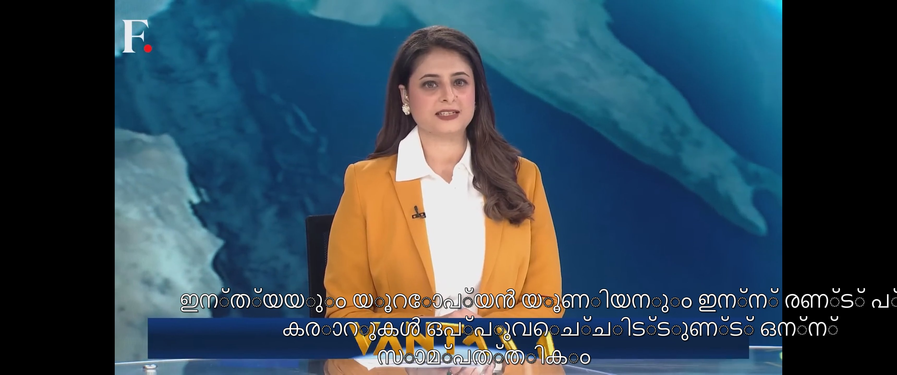
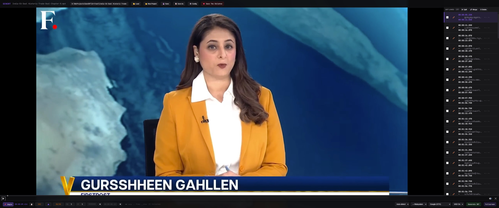

# GenSRT — User Guide

Generate subtitles for any video, in any language, using a desktop app.
No command line required.

This guide covers the GUI app. For batch processing, CLI flags, and the
full set of tuning knobs, see [README.md](README.md).

---

## What you can do with it

Drop a video onto the app, click *Generate SRT*, and a few minutes later
you have a subtitle file sitting next to your video. The subtitles can
be in the original language of the audio, or translated into your choice
of target language.

Here's what the result looks like, played back in PotPlayer:

That's a Firstpost news clip (English/Hindi audio), transcribed and
translated to Malayalam by GenSRT, then loaded as a subtitle track in
PotPlayer.

The same `.srt` file works in VLC, Jellyfin, Kodi, web browsers, and
just about anything else that plays video.

---

## Installation

Two options:

**Option 1 — Use the standalone build.**
Run the installer from https://github.com/mountlord/GenSRT/releases. No Python required. The
first run will take a few minutes to download Whisper model weights
(~800 MB) — subsequent launches are instant.

**Option 2 — Install from source.**
See [README.md](README.md#installation). You'll need Python 3.10+,
CUDA 12.8, and FFmpeg.

Either way, you also need:

- An NVIDIA GPU with CUDA 12.8 installed (CPU works but is much slower)
- FFmpeg on your system PATH
- An internet connection (for Google Translate; the Whisper model also
  downloads on first run)

---

## The interface

The window has four areas:

**Top bar** — filename, full path of the currently loaded video, and
project buttons (Load, New Project, Save, Save As, Config). The "Save
The Children" link is a donation prompt; the rest of the app works
without clicking it.

**Video player (left)** — drag a video here, or use the *Load* button.
Standard playback controls.

**SRT lines (right)** — each subtitle line shows its start time, the
text, and its end time. Click a row to seek the video to that point.
Each row has a checkbox (for Split) and a pencil icon (for Edit).

**Footer (bottom)** — selectors that control how the next *Generate
SRT* run will work:

| Control | What it does |
|---|---|
| Source language | What language the audio is in (`Auto-detect` lets Whisper figure it out) |
| Target language | What language to translate the subtitles into |
| Translation engine | Which service does the translation (Google is the default, recommended for non-English targets) |
| VAD On/Off | Voice Activity Detection — filters out silence before transcription. Usually leave on. |
| Generate SRT | The big button. Starts the transcription job. |

These are per-job overrides. To change your defaults permanently, click
the *Config* button in the top bar.

---

## Generate your first SRT

1. **Drag a video file** onto the player area. Or click *Load* and pick
   one from a file dialog. Supported formats: mp4, mkv, ts, m2ts, mts,
   m4v, mov, avi, webm.

2. **Set the languages in the footer** if needed.
   - For Korean audio → Malayalam subtitles: source = `Korean`,
     target = `Malayalam`, engine = `Google (GTX)`
   - For English audio → English subtitles (transcription only):
     source = `Auto-detect`, target = `English`
   - For "keep it in the original language, don't translate": set
     source and target to the same language

3. **Click *Generate SRT***. A progress bar appears. The first run
   loads the Whisper model into your GPU's memory (takes a few
   seconds), then processes the audio. For a 20-minute video on an
   RTX 3060 Ti, expect ~1-2 minutes total.

4. **The SRT lines appear in the right pane** once it's done. They're
   also written to disk next to your video. See *File naming* below.

5. **Review the result.** Click any row to seek the video to that
   line. You can fix anything that looks wrong (see *Editing* below)
   or just hit Save and move on.

---

## Watching with subtitles

GenSRT writes a plain `.srt` file next to your video. Open the video in
any player that supports SRT subtitles:

- **PotPlayer** — auto-detects sidecar SRTs
- **VLC** — auto-detects, or Subtitle menu → Add Subtitle File
- **Jellyfin / Plex / Kodi** — server-side; subtitles appear as a
  selectable track
- **Web browsers via HTML5** — works if you wrap the video and SRT in
  a webpage with a `<track>` element (or convert to `.vtt`, see Roadmap
  in README.md)

If you generated multiple language SRTs for the same video, media
servers like Jellyfin will surface each as a separate track that you
can switch between in the player.

---

## Editing subtitles

GenSRT is fast and accurate, but transcription is never perfect. The
SRT lines panel is a built-in editor for fixing things up before you
commit the final file.

**Click a row** → seeks the video to that line and pauses, so you can
hear what was actually said.

**Edit a line** — click the pencil icon on the right of the row. A
modal opens with the text, start time, and end time, all editable.

**Split a line** — when one SRT line covers too much speech, you can
split it into two. Check the row's checkbox, then click *Split* at
the top of the right pane. A modal opens with two halves you can
fine-tune.

**Delete lines** — check one or more row checkboxes, click *Delete*,
confirm. Subtitle indices renumber automatically on save.

**Save** — writes back to the loaded `.srt` file.

**Save As** — writes to a different filename / location. Next *Save*
goes to the new path.

---

## Languages and engines

GenSRT supports any source language Whisper recognises (~100
languages). For translation:

- **Google Translate** is the default and supports any → any
  translation. This is what you want for Malayalam, Tamil, Telugu,
  Bengali, Hindi, etc. Requires an internet connection.
- **NLLB-200** (Meta) and **MarianMT** (Helsinki-NLP) are offline
  engines, but they only translate *to English*. They're useful if
  you're transcribing Korean / Japanese / etc. into English and
  don't want to depend on Google.
- **None (passthrough)** — keeps subtitles in the source language
  with no translation.

If you pick Marian or NLLB with a non-English target, the app will
refuse with a clear message ("Target language 'ml' is only supported
by the 'google' translation engine…"). Switch to Google or change
the target to English.

---

## File naming

Subtitles land next to the video with this naming convention:

| Target language | File written |
|---|---|
| English | `MyVideo.srt` |
| Malayalam | `MyVideo.ml.srt` |
| Korean | `MyVideo.ko.srt` |
| Hindi | `MyVideo.hi.srt` |
| (any other) | `MyVideo.<lang>.srt` |

English stays unsuffixed for compatibility with files you already have.
All other languages get an ISO 639-1 code suffix. This matches the
convention used by Plex, Jellyfin, and Kodi — so multiple language
tracks for the same video coexist cleanly.

When you drop a video that already has a sidecar SRT, GenSRT loads it
into the right pane automatically. If both `MyVideo.srt` and
`MyVideo.ml.srt` exist, the unsuffixed one wins by default — drag the
language-suffixed file directly if you want to edit that one instead.

---

## Tips

- **Whisper model choice matters for accuracy.** The default
  `large-v3-turbo` is a good balance. For Korean (and other languages
  with subtle phonetic distinctions), `large-v3` produces noticeably
  better results at the cost of being ~3x slower. Change this in
  Config → Transcription → model.

- **VAD off if VAD is eating speech.** Voice Activity Detection
  occasionally filters out real dialogue (especially soft-spoken or
  accented audio). The footer toggle is the quickest way to try a
  run without it.

- **Auto-detect is usually fine, but explicit is faster.** If you
  know the source language, setting it in the footer skips the
  detection step and saves a few seconds per file.

- **Save As is your "make a copy before editing" button.** Hit it
  before you start editing if you want to preserve the original
  Generate output.

- **Config changes propagate live.** When you save settings in the
  Config modal, the footer selectors update immediately — no need
  to relaunch.

---

## Troubleshooting

**"CUDA not available" or transcription is very slow.**
The CPU fallback works but is much slower than GPU. Confirm CUDA 12.8
is installed (`nvidia-smi` should show your GPU). If you don't have
an NVIDIA GPU, CPU mode is expected to be slow — a 20-minute video
might take ~30 minutes instead of ~1 minute.

**Video won't load (file with Korean / non-ASCII characters in the
name).**
Known issue with the embedded video player. Workaround: rename the
file to use ASCII characters in the filename. The transcription itself
handles all languages fine — it's just the player widget that's picky
about filenames.

**The SRT file appears next to the video, but the right pane is
empty.**
Check the engine selector in the footer. If you picked Marian or NLLB
with a non-English target, the job fails silently in some setups.
Switch to Google.

**Subtitles appear slightly before the speaker actually starts
speaking.**
Lower `vad_speech_pad_ms` in Config → VAD & Subtitle Timing. Default
is 200 ms; try 100 ms.

**Whisper hallucinated text in silent sections.**
Raise `vad_threshold` in Config → VAD & Subtitle Timing. Default is
0.5; try 0.6 or 0.7.

---

## Getting help

For deeper tuning and CLI usage, see [README.md](README.md).
